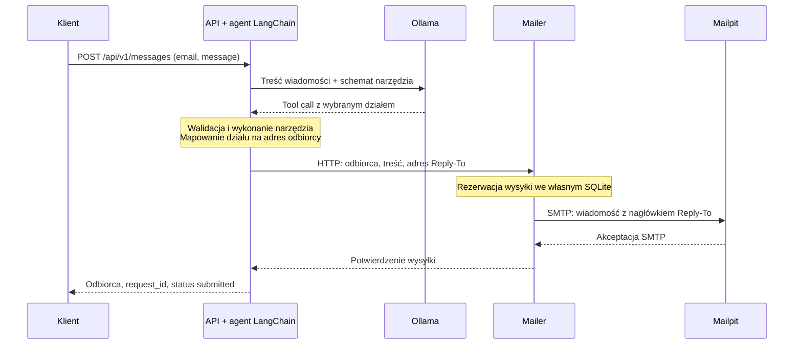

# Inteligentny router wiadomości

Samodzielny PoC mikroserwisów: Python, FastAPI, LangChain, lokalna Ollama i Mailpit.
Agent interpretuje wiadomość, wybiera dział przez natywne function calling i wykonuje
narzędzie wysyłki. Osobny mailer przekazuje oryginalną treść przez SMTP do Mailpit,
z nagłówkiem `Reply-To` ustawionym na adres nadawcy z requestu.

## Uruchomienie

Wymagania: Docker Engine / Docker Desktop z Compose **2.24 lub nowszym**, internet
przy pierwszym pobraniu obrazów, źródeł i wag oraz wolne porty 8000 i 8025.
Zalecenie startowe: 8 GB RAM dla Dockera i zapas miejsca na obrazy, kompilację
oraz model; nie jest to zmierzony minimalny próg. Domyślny wariant używa CPU.
Nie wymaga Pythona ani klucza API na hoście.

Na Windows pliki `services/ollama/*.patch` muszą zachować końce linii
LF: Dockerfile weryfikuje ich dokładne sumy SHA-256 przed zastosowaniem poprawek.
Reguła w `.gitattributes` chroni je także przy `core.autocrlf=true`.
Konwersja tych plików do CRLF powoduje błąd sumy kontrolnej podczas budowy.

Z głównego katalogu projektu:

```sh
docker compose up -d
```

Nie trzeba tworzyć `.env`. Compose buduje obrazy, uruchamia Ollamę i Mailpit,
pobiera `gemma4:e2b`, rozgrzewa model i sprawdza natywne tool calling bez wysyłki
maila. API startuje dopiero po inicjalizacji modelu i gotowości mailera.
Jednorazowy serwis `ready` zależy od zdrowego API i domyka start `up -d`.
Stan `Exited (0)` serwisów `model-init` i `ready` jest prawidłowy.

Pierwszy start obejmuje kompilację poprawionego backendu Ollama i pobranie wag.
Kolejne starty wykorzystują cache i zachowane wolumeny. Błąd inicjalizacji
blokuje start API, zamiast zgłaszać pozorną gotowość.

- Swagger: <http://localhost:8000/api/v1/docs>
- OpenAPI: <http://localhost:8000/api/v1/openapi.json>
- Mailpit: <http://localhost:8025>
- Gotowość: <http://localhost:8000/health/ready>

```sh
curl --fail-with-body http://localhost:8000/api/v1/messages \
  -H 'Content-Type: application/json' \
  -d '{"email":"jan.nowak@example.com","message":"Chciałbym zgłosić urlop na jutro"}'
```

Przykładowy kształt odpowiedzi; identyfikatory są generowane dla requestu:

```json
{
  "request_id": "e19f7b8a-1d0b-4a54-9f7c-cb0674fa5950",
  "recipient": "kadry@example.com",
  "status": "submitted",
  "message_id": "<e19f7b8a-1d0b-4a54-9f7c-cb0674fa5950@message-router.local>"
}
```

W panelu Mailpit powinna pojawić się wiadomość do `kadry@example.com`,
z `Reply-To: jan.nowak@example.com` i niezmienioną treścią. `submitted` oznacza
akceptację SMTP, nie przeczytanie wiadomości. Domyślne środowisko nie dostarcza
maili na zewnętrzne skrzynki.

Po zmianie kodu użyj `docker compose up -d --build`. Zatrzymanie bez usuwania
modeli, wiadomości i rejestru wysyłek:

```sh
docker compose stop
```

`docker compose down` bez `--volumes` również zachowuje dane. Nie używaj
`down --volumes` do zwykłego restartu ani rozwiązywania problemów.

## Architektura i Service Layer Pattern



| Kontener                       | Odpowiedzialność                                             |
| ------------------------------ | ------------------------------------------------------------ |
| `api`                          | Publiczny endpoint, agent LangChain i narzędzie wysyłki      |
| `mailer`                       | Osobne API, MIME, SMTP i trwały rejestr wysyłek w SQLite     |
| `mailpit`                      | Przechwytywanie poczty oraz panel i API do jej kontroli      |
| `ollama`                       | Lokalny LLM przez OpenAI-compatible Chat Completions         |
| `model-init`                   | Pobranie, rozgrzanie i kontrola modelu przed startem API     |
| `ready`                        | Jednorazowa kontrola HTTP po zdrowym API; domknięcie `up -d` |
| `laya-adapter`, `laya-runtime` | Opcjonalny wariant klasyfikatora, wyłączony domyślnie        |

Router, mailer i adapter mają niezależne obrazy, zależności i kontrakty HTTP.
Nie importują kodu sąsiada ani nie współdzielą bazy. SQLite jest prywatnym
magazynem mailera, bez osobnego kontenera. Mailer nie zna modelu, router nie zna
SMTP ani bazy mailera. `model-init` i `ready` nie uczestniczą w obsłudze zgłoszeń.

W aplikacjach biznesowych kontroler HTTP waliduje DTO i mapuje błędy, service
layer realizuje przypadek użycia przez porty `Protocol`, a domena nie zależy od
FastAPI, LangChain ani SMTP. Adaptery implementują komunikację i zapis danych.
Composition root w `main.py` tworzy zależności podczas startu aplikacji.

`create_agent(model=ChatOpenAI(...), tools=[...])` zarządza wywołaniem modelu
oraz narzędzia. Middleware sprawdza tool call przed dostawą, a `return_direct=True`
kończy agenta po wykonaniu narzędzia. Nie ma własnej pętli agenta, naprawiania
odpowiedzi, dodatkowej inferencji po wysyłce ani reguł konkretnego modelu w aplikacji.

Sieć `smtp` jest wewnętrzna i niedostępna routerowi. Porty SMTP, mailera i modeli
nie są publikowane na hoście. API i panel Mailpit są publikowane wyłącznie na
loopback. Mailpit potrzebuje dodatkowej sieci `mailpit-ui`, aby jego panel był
dostępny z hosta; nie należy zastępować jej wyłącznie siecią `internal`.

## Zasady routingu

Model otrzymuje treść i opisy działów, nie adres nadawcy, token mailera ani
odpowiedź wzorcową. Wybiera `department`; aplikacja mapuje ten wybór na adres.
Jawna polityka rozdziela podobne kompetencje HR/kadr oraz help desku/IT:

| Wartość `department` | Adres docelowy                | Zakres                                                                         |
| -------------------- | ----------------------------- | ------------------------------------------------------------------------------ |
| `human_resources`    | `human-resources@example.com` | Rekrutacja, szkolenia, rozwój i relacje pracownicze                            |
| `payroll`            | `kadry@example.com`           | Urlopy, płace, czas pracy i dokumenty zatrudnienia                             |
| `help_desk`          | `help-desk@example.com`       | Komputer, aplikacje, drukarka, hasła i dostęp pojedynczego użytkownika         |
| `it`                 | `it@example.com`              | Infrastruktura, serwery, awarie sieci/systemów i cyberbezpieczeństwo           |
| `other`              | `other@example.com`           | Pozostałe sprawy, niezrozumiała treść lub brak aktualnej rozpoznawalnej prośby |

Decyduje aktualna prośba, nie wzmianka w zakończonej historii. Na przykład
problem z logowaniem do portalu urlopowego należy do help desku, a organizacja
szkolenia o płacach do HR. Dla kilku tematów model wybiera główną prośbę.
`other` również uruchamia narzędzie wysyłki. Awaria modelu daje błąd, nie
automatyczne przekazanie do fallbacku.

## Kontrakty, błędy i dane

### API publiczne

`POST /api/v1/messages` przyjmuje wyłącznie `email` i `message`.
Adres jest walidowany składniowo; wiadomość ma 1-4000 znaków i nie może zawierać
samych białych znaków. Nadmiarowe pola są zabronione.

HTTP 200 zwraca `request_id`, `recipient`, `status: submitted` i `message_id`.
HTTP 422 oznacza błąd wejścia. HTTP 502 zawiera `code` oraz `request_id`, np.
`model_unavailable`, `invalid_tool_call` lub błąd dostawy.

`/health/live` sprawdza proces. `/health/ready` sprawdza obecność wybranego modelu
przez `/v1/models` i gotowość mailera; niedostępność daje 503. Healthcheck nie
mierzy trafności klasyfikacji.

### Mailer wewnętrzny

`POST /internal/v1/deliveries` wymaga `Authorization: Bearer <MAILER_TOKEN>`:

```json
{
  "request_id": "e19f7b8a-1d0b-4a54-9f7c-cb0674fa5950",
  "recipient": "kadry@example.com",
  "reply_to": "jan.nowak@example.com",
  "message": "Chciałbym zgłosić urlop na jutro"
}
```

Odbiorca musi należeć do skonfigurowanej listy. SMTP envelope ma dokładnie jednego
odbiorcę; brak parametrów CC/BCC. `From` i `Subject` ustala mailer. `Reply-To`
i niezmieniona treść pochodzą z pierwotnego requestu.

UUID jest kluczem idempotencji mailera i nagłówkiem `X-Request-ID`. Rezerwacja
w SQLite następuje **przed SMTP**. Ten sam UUID i payload zwracają poprzedni
wynik; inny payload daje HTTP 409 `idempotency_conflict`. Trwająca wysyłka daje
409 `delivery_in_progress`. Brak lub błędny token daje 401; walidacja lub
niedopuszczony odbiorca daje 422.

Statusy rejestru to `sending`, `submitted`, `failed` i `unknown`. Znane odrzucenie
daje `delivery_failed`; niepewny wynik SMTP lub awaria utrwalenia jego wyniku daje
`delivery_unknown`. Brak możliwości zapisania rezerwacji daje `mailer_unavailable`
bez próby SMTP. Po restarcie niedokończone `sending` staje się `unknown`.
Mailer pracuje jako **jedna instancja na wolumen**.

Chronione `GET /internal/v1/deliveries/{request_id}` zwraca status, bez oryginalnej
treści; nieistniejące zlecenie daje 404. Nie jest to publiczny endpoint routera.
**Ponowny publiczny POST tworzy nowe zgłoszenie.** Nie ponawiaj niepewnej wysyłki
bez sprawdzenia Mailpit i rejestru. Nie ma automatycznego retry modelu ani mailera.

Rejestr przechowuje hash payloadu i potwierdzenia; pełne wiadomości przechowuje
Mailpit. Zwykłe logi nie zawierają treści ani nadawcy. Domyślny token mailera jest
publiczną wartością lokalnego PoC. To nie jest wdrożenie produkcyjne: brak
publicznego uwierzytelniania, limitów ruchu, HA i produkcyjnego MTA. Unified Mail
Core nie jest wymagany ani dołączony; przyszły adapter nie może przedstawiać
statusu `queued` jako `submitted`.

## Konfiguracja modelu i dostawców

Pełną listę zmiennych zawiera [`.env.example`](.env.example). Wspólny klient
pozostaje `ChatOpenAI`; zmieniają się `OPENAI_BASE_URL`, `OPENAI_API_KEY`,
`OPENAI_MODEL` i sposób inicjalizacji. Domyślne ustawienia:

| Zmienna                   | Wartość                  |
| ------------------------- | ------------------------ |
| `OPENAI_BASE_URL`         | `http://ollama:11434/v1` |
| `OPENAI_MODEL`            | `gemma4:e2b`             |
| `MODEL_TOOL_CHOICE`       | `required`               |
| `MODEL_REASONING_EFFORT`  | `none`                   |
| `MODEL_TEMPERATURE`       | `0`                      |
| `MODEL_TOP_P`             | `0.8`                    |
| `MODEL_MAX_TOKENS`        | `1024`                   |
| `MODEL_TOKEN_LIMIT_FIELD` | `max_tokens`             |
| `MODEL_TIMEOUT_SECONDS`   | `180`                    |
| `MODEL_TRACE`             | `false`                  |

Puste opcjonalne ustawienia pomijają pola nieobsługiwane przez innego dostawcę.
`MODEL_TOOL_CHOICE` obsługuje puste/`auto`/`required`/`named`; `named` wskazuje
`send_department_email`, a w inicjalizatorze jego własne narzędzie gotowości.
`MODEL_TOKEN_LIMIT_FIELD` może wskazywać `max_completion_tokens` dla innego API.
Sam format OpenAI-compatible nie gwarantuje zgodności narzędzi ani parametrów.
Nie ma automatycznego ponowienia z innymi ustawieniami.

Odpowiedź musi zawierać dokładnie jeden natywny `send_department_email` z jedynym
argumentem `department` należącym do enum. Dodatkowe argumenty, błędna nazwa,
wiele wywołań, brak wywołania i jawne `finish_reason=length` są odrzucane przed
wysyłką. Tekst lub JSON w treści odpowiedzi nie zastępuje `tool_calls`.
Samo zużycie limitu tokenów nie dowodzi obcięcia odpowiedzi.

### Warianty przez env

| Wariant          | Plik przykładowy          | Sposób decyzji                                             |
| ---------------- | ------------------------- | ---------------------------------------------------------- |
| Ollama, domyślny | `.env.ollama-example`     | Lokalny LLM i natywny tool call                            |
| OpenRouter       | `.env.openrouter-example` | Zewnętrzny model obsługujący tools; wymaga własnego klucza |
| Laya, opcjonalny | `.env.laya-example`       | Klasyfikator i adapter protokołu; profil `laya`            |

```sh
docker compose --env-file .env.ollama-example up -d
docker compose --env-file .env.laya-example up -d
```

Dla OpenRouter skopiuj jego przykład do ignorowanego `.env`, ustaw własny klucz
i model obsługujący tools, następnie uruchom `docker compose up -d`. Jest to
alternatywny wariant, nie wariant spełniający wymaganie lokalnego LLM z zadania.
Ollama pozostaje w Compose także przy zewnętrznym dostawcy, ale
`MODEL_BOOTSTRAP=external` pomija pobieranie jej wag.

`COMPOSE_PROFILES=laya` w przykładzie Laya włącza runtime i adapter; ten sam
plik kieruje klienta API do adaptera. Sam profil nie przełącza endpointu.
Bez profilu kontenery ani wagi Laya nie są budowane/pobierane. Wyłączenie profilu
nie zatrzymuje już uruchomionych kontenerów. Powrót do Ollamy:

```sh
docker compose --env-file .env.laya-example stop laya-adapter laya-runtime
docker compose --env-file .env.ollama-example up -d
```

### Granice wariantu Laya

Laya to model typowanych decyzji, nie LLM emitujący natywne function calling.
Adapter obsługuje jeden tekst użytkownika i jedno narzędzie z argumentem string
`enum`; mapuje opisy singletonów `anyOf` na kryteria klasyfikatora i opakowuje
wynik `choice` w `tool_calls`. Nie zna adresów działów, nie stosuje reguł słów
kluczowych i nie ma dostępu do mailera. Laya otrzymuje pytanie i opisy opcji,
nie pełny system prompt Gemmy.

Domyślny profil używa bazowego `multilingual` przez `laya==0.3.20`, z
`Router.predict(..., max_len=8192)` i `POST /v1/systemone`. Nie ładuje automatycznie
lokalnych wag po treningu. Adapter odrzuca streaming, multimodalność, historię
narzędzi, nieobsługiwane pola i kontekst przekraczający 7000 bajtów, zamiast go
obcinać. Model ma także limity pytania i opcji: 256 tokenów łącznie dla pytania
z opcjami oraz 48 na opis opcji z etykietą; budżet bajtów nie zastępuje tokenizacji.
`TORCHINDUCTOR_CACHE_DIR` musi wskazywać zapisywalne `/tmp`, ponieważ numeryczny
UID kontenera nie ma wpisu w passwd.

**Wariantem spełniającym wymaganie lokalnego LLM i natywnego tool calling jest
Ollama.** Laya pozostaje opcjonalnym eksperymentem porównawczym.

## Poprawki backendu Ollama

Domyślna wersja to `0.34.4-poc.tool-choice.2`, budowana w
[`services/ollama/`](services/ollama/) na oficjalnym obrazie
Ollama. Dockerfile przypina źródła, obraz bazowy i sumy kontrolne poprawek oraz
uruchamia testy regresji i `go vet` podczas budowy.

Poprawki zachowują serializację narzędzi Qwen (PR 18391/17284), kierują małą
Gemmę przez natywny szablon i gramatykę, zachowują wymagany separator ciągu
w parserze i przekazują standardowe `tool_choice` do natywnego runnera.
Przebudowywany jest również pasujący `libllama-common`; oficjalne biblioteki
inferencji i wagi pozostają niezmienione. Nie zastępuj obrazu przypadkową wersją
upstream ani nie przenoś napraw do agenta.

```sh
docker compose build ollama
docker compose up -d --build
docker compose exec -T ollama ollama --version
```

`required` i nazwany wybór są obsługiwane na zweryfikowanej ścieżce natywnej;
nieobsługiwane wymagania na ścieżce renderowanej kończą się jawnym błędem.
Gramatyka ogranicza nazwę funkcji i składnię wartości, **nie gwarantuje pełnej
zgodności ze schematem argumentów ani trafności działu**. Zachowaj walidację
aplikacyjną. Kontynuacja rozmowy po wyniku narzędzia pozostaje niezweryfikowana
jako działająca, a tools z logprobs nie są obsługiwane w tej ścieżce.
PoC nie korzysta z tych funkcji: kończy się po jednym narzędziu.

Historyczny rollback do `0.34.4-poc.gemma-native.2` wymaga zachowanego obrazu,
zmiany wyboru obrazu Compose oraz pustego `MODEL_TOOL_CHOICE`. Cofnięcie usuwa
naprawę wymuszania narzędzia i przywraca znane braki wywołań; nie jest gotowym
wariantem odbiorowym. Nie usuwaj wolumenu modeli podczas rollbacku. Aktualną
wersję odtwarza powyższa standardowa budowa.

## Testy i diagnostyka

```sh
# Walidacja konfiguracji bez uruchamiania usług.
docker compose config --quiet
docker compose --env-file .env.laya-example config --quiet
docker compose --env-file .env.openrouter-example config --quiet

# Testy jednostkowe, kontraktowe i granic architektury; runtime bez sieci.
docker compose --profile test run --build --rm tests

# Działający model + HTTP + SMTP + Mailpit; 15 wiadomości po polsku.
docker compose --profile test run --build --rm e2e

docker compose ps -a
docker compose logs --tail 100 model-init ready api mailer
```

E2E kontroluje Swagger, odpowiedź API, rzeczywisty surowy MIME, odbiorcę,
`Reply-To`, `Message-ID`, korelację i oryginalną treść. Wypisuje JSONL z
identyfikatorami i czasami, a dowolny błąd daje niezerowy exit code. Każde
uruchomienie tworzy nowy zestaw syntetycznych maili. Nie usuwa starej poczty.
`MAILPIT_MAX_MESSAGES` (domyślnie 10 000) musi pomieścić istniejące i nowe maile,
aby Mailpit nie usunął najstarszych przez limit retencji.

### Obserwowane sprawdzenie pojedynczego zgłoszenia

`MODEL_TRACE=true` zapisuje surowy request, odpowiedź, parsowanie, walidację
oraz wynik dostawy ze wspólnym `request_id`. To ustawienie wyłącznie do lokalnych
syntetycznych wiadomości; treści nie są redagowane. Nie używaj go do rzeczywistej
korespondencji ani payloadów zawierających sekrety.

```sh
MODEL_TRACE=true docker compose up -d --no-deps api
curl --fail-with-body http://localhost:8000/api/v1/messages \
  -H 'Content-Type: application/json' \
  -d '{"email":"test@example.com","message":"Nie działa mi komputer."}'
docker compose logs --no-color api mailer
```

Przed kolejną próbą sprawdź skorelowany natywny tool call, rezultat walidacji i
rzeczywistą wiadomość w Mailpit, włącznie z `Reply-To`. Zachowaj wynik również
przy błędzie i nigdy automatycznie nie ponawiaj niepewnego POST. Zapisz potrzebne
logi przed odtworzeniem kontenera, po czym wyłącz śledzenie:

```sh
MODEL_TRACE=false docker compose up -d --no-deps api
```

Lokalne kontrole kodu w już przygotowanym środowisku Python:

```sh
.venv/bin/pytest -q
.venv/bin/ruff check services tests verification
.venv/bin/ruff format --check services tests verification
```

### Restart i problemy pierwszego uruchomienia

Po nieudanym pobraniu zachowaj wolumen, sprawdź log `model-init`, ponów
`docker compose up -d model-init`, a następnie `docker compose up -d`.
Błędy modelu, klucza, timeoutu lub tool calling muszą pozostać widoczne;
nie osłabiaj sondy gotowości ani nie podstawiaj atrapy.

Sprawdzenie bariery startowej, bez opóźnienia i ponowień klienta:

```sh
docker compose stop
docker compose up -d && curl --fail --max-time 10 http://localhost:8000/health/ready
```

Na hoście weryfikacji wystąpił także timeout klienta Docker przed utworzeniem
kontenerów. Publiczne pobrania/budowa zadziałały z osobną konfiguracją klienta
z pustym `auths` i kontenerem `docker:cli`; nie zmieniano ustawień użytkownika.
Przy podobnym problemie sprawdź endpoint Dockera, dostęp do rejestrów i helper
poświadczeń przed zmienianiem aplikacji. Przyczyny pierwszego timeoutu nie
ustalono; ta uwaga nie oznacza wymogu dodatkowego kontenera do normalnego startu.

## Weryfikacja

### Windows / x86-64 — 29.09.2026

Aktualny kod (`aa50abc2cfdc5b9e5d47ae7d312b2be55fb57797` plus poniższa
poprawka `.gitattributes`) sprawdzono na Windows z Docker Desktop Linux x86-64,
12 vCPU i 15,42 GiB RAM, na CPU. Użyto nowych kontenerów i pustych wolumenów
w osobnym projekcie `wskz-acceptance-20260929`, z domyślnymi ustawieniami
i pustym plikiem env. Stare środowisko `message-router` i jego dane zachowano.

Pierwsze `up -d` ujawniło błąd przenośności: `core.autocrlf=true` zmieniało
bajty patchy na CRLF, przez co kontrola SHA-256 zatrzymywała budowę Ollamy.
Dodano `.gitattributes` wymuszający LF wyłącznie dla patchy backendu i przywrócono
ich oryginalne bajty. Sum kontrolnych ani treści poprawek nie zmieniano.
Sprawdzono także wynik filtrów checkoutu Git przy `core.autocrlf=true`.

Po tej poprawce zwykłe `up -d` zbudowało Ollamę ze źródeł wraz z testami
backendu, pobrało `gemma4:e2b` do pustego wolumenu, zaliczyło sondę natywnego
tool calling i udostępniło zdrowe API. Cache niezmienionych warstw obrazów
aplikacyjnych był dostępny; nie był to test całkowicie pustego cache Dockera.

| Kontrola | Wynik |
| --- | --- |
| Testy aplikacji w świeżo zbudowanym kontenerze | 134/134 |
| Ruff: lint i formatowanie | Zaliczone |
| Pierwszy start i późniejszy pełny stop/start | Natychmiastowe HTTP 200 po każdym `up -d`, bez retry klienta |
| 15 przypadków z `verification/cases.json` | 15/15 za pierwszą próbą, po 3 na każdy dział |
| Natywny tool call, walidacja, dostawa | 75 skorelowanych zdarzeń trace, po 5 na przypadek |
| MIME: odbiorca, Reply-To, treść, Message-ID, X-Request-ID | Poprawne we wszystkich 15 przypadkach |
| Błędny adres, pusta treść, brak treści | 3 odpowiedzi 422, bez nowej poczty |
| Swagger i Mailpit z hosta w przeglądarce | Zaliczone; widoczne wiadomości i Reply-To |
| Request z README przez cURL, po restarcie i z trace=false | Poprawna dodatkowa wiadomość do kadr |
| Liczba wiadomości po kontroli | 16, bez duplikatów |

Każdy przypadek sprawdzono przed następnym żądaniem. Nie uruchamiano benchmarku
500 wiadomości ani treningu. Po kontroli pozostawiono nowe usługi uruchomione
na portach 8000 i 8025, z `MODEL_TRACE=false`. Ich obsługa z katalogu repozytorium:

```sh
docker compose -p wskz-acceptance-20260929 ps -a
docker compose -p wskz-acceptance-20260929 stop
```

Przed uruchomieniem innego projektu Compose na tych samych portach zatrzymaj
ten projekt. Lokalny komplet dowodów (log błędu i udanej budowy, 15 wyników,
trace, MIME, zrzuty przeglądarki, restart i `summary.json`) zachowano pod
`%LOCALAPPDATA%/wskz-poc/acceptance-20260929`. Nie jest częścią repozytorium.

### Historyczny odbiór ARM64 — 28.09.2026

**28.09.2026 PoC zaliczył sprawdzenie wszystkich kryteriów zadania.**
Świeży klon, budowa serwisów i poprawionej Ollamy ze źródeł oraz automatyczne
pobranie modelu z pustymi wolumenami zakończyły się powodzeniem bez `.env`.
Swagger i panel Mailpit sprawdzono także w rzeczywistej przeglądarce.

| Kontrola                                                    | Wynik                                             |
| ----------------------------------------------------------- | ------------------------------------------------- |
| Testy na hoście i w świeżym kontenerze                      | 134/134 w każdym środowisku                       |
| Obserwowane HTTP → natywny tool call Gemmy → SMTP → Mailpit | 15/15 za pierwszym razem, po 3 na każdy dział     |
| Odbiorca, Reply-To, treść, Message-ID i korelacja           | Poprawne we wszystkich 15; brak duplikatów        |
| Błędny e-mail, pusta wiadomość, brak wiadomości             | 3 odpowiedzi 422, bez nowej poczty                |
| Restart po naprawie `ready`                                 | 2/2 z natychmiastowym HTTP 200, bez sleep i retry |
| Dokładny przykład cURL z README, śledzenie wyłączone        | Poprawna szesnasta wiadomość do kadr              |
| Ruff i konfiguracje Compose                                 | Zaliczone                                         |

W trakcie kontroli znaleziono wyścig: `up -d` wracało, gdy API dopiero startowało.
Dodano wyłącznie barierę `ready`. Pierwsza budowa/pobranie oraz 15 przypadków
poprzedzały tę poprawkę; oba restarty i dodatkowy cURL sprawdziły końcową
konfigurację. Kod aplikacji, prompt i ustawienia modelu nie zmieniały się.

Środowisko: Apple M4, Docker Desktop Linux ARM64, 10 vCPU, VM 12 GiB, CPU.
Nie sprawdzono x86, GPU, produkcyjnego SMTP ani jakości na nieznanej rzeczywistej
korespondencji. Zaliczenie PoC nie oznacza idealnej klasyfikacji dowolnego tekstu.
Po weryfikacji zatrzymano usługi i przeglądarkę, wyłączono trace, zachowano dane.

### Identyfikacja zweryfikowanej wersji i zachowane dowody

Klon bazowy: commit `8936b86a66f84ebfc764d7a73fe2321294486df3`, plus opisana
poprawka Compose. Historyczne SHA-256 poniżej identyfikują pliki z chwili
weryfikacji, nie późniejsze zmiany komentarzy i dokumentacji:

```text
Compose: 669a657bd9561d7e4f35619846b7e33687bd581c987f39b9c92729cb8438ffd5
15 cases: 34b55ac3f3854c93547500fa60e7b4344dc41f42c1be31a0fb9c016d91da131b
Ollama image: sha256:96dc17e704990906e8b218884145e1fdb98079ac4233bbb7640a94223eb327f4
Final cURL request_id: c3c27c08-0448-4df3-acb3-ab0f259f0609
```

Na hoście weryfikacji zachowano logi budowy/startu w kontenerze
`wskz-acceptance-build-20260928`, testów w `wskz-acceptance-unit-20260928`
i 75 zdarzeń trace w `wskz-acceptance-trace-20260928`. Można je odczytać przez
`docker logs <nazwa>`, bez uruchamiania kontenera. Wiadomości i modele są w
wolumenach `wskz-acceptance-20260928_captured-mail` oraz
`wskz-acceptance-20260928_ollama-models`. Klon z lokalnymi snapshotami przeglądarki:
`/Users/mini/programming/wskz-poc-acceptance-20260928`.
Te lokalne artefakty nie są częścią świeżego klonu repozytorium.

## Porównanie Gemma i Laya

Wcześniejsza, odrębna od odbioru E2E regresja z 27.09.2026 używała tych samych
500 syntetycznych wiadomości, po jednej próbie, bez SMTP i ponowień.

| Miara                            | Laya multilingual, epoka 1 | Gemma 4 E2B Q4_K_M |
| -------------------------------- | -------------------------: | -----------------: |
| Poprawne odpowiedzi              |            432/500 (86,4%) |    493/500 (98,6%) |
| Błędne działy                    |                         68 |                  7 |
| Błędy protokołu                  |                          0 |                  0 |
| Mediana HTTP                     |                    0,231 s |            1,800 s |
| P95 HTTP                         |                    0,346 s |            2,590 s |
| Suma czasu 500 żądań, bez przerw |                  119,981 s |          909,394 s |
| HR /100                          |                         87 |                 99 |
| Kadry /100                       |                         99 |                 96 |
| Helpdesk /100                    |                        100 |                 99 |
| IT /100                          |                         86 |                100 |
| Inne /100                        |                         60 |                 99 |

Laya miała 7,8 razy krótszą medianę, ale o 61 poprawnych klasyfikacji mniej.
Największą słabością były nieokreślone/prywatne wiadomości i rozróżnianie aktualnej
prośby od zakończonej historii. To sekwencyjne żądania na lokalnym CPU Apple M4
przez Docker, z różnymi promptami i adapterami. Gemma była poprawiana na znanym
zbiorze, więc **nie jest to niezależny test generalizacji**. Nie należy utożsamiać
tej regresji z powyższą weryfikacją rzeczywistej dostawy SMTP.

Korpus [`verification/benchmark/cases-500.json`](verification/benchmark/cases-500.json)
zawiera 250 rodzin scenariuszy z dwoma skorelowanymi wariantami, po 100 wiadomości
na dział. Rodziny muszą pozostać razem przy podziale danych. Etykiet, uzasadnień
i identyfikatorów nigdy nie przekazuje się modelowi. Domyślny test to nadal 15
wiadomości; pełny benchmark wymaga odrębnego, jawnego zlecenia. Nie należy
uruchamiać treningu ani kolejnych 500 przypadków przy zwykłym utrzymaniu PoC.

### RAM i dysk

Nie zmierzono porównywalnego RAM ani CPU-sekund obu modeli podczas tych 500
żądań. Krótszy czas odpowiedzi nie dowodzi niższego kosztu energii ani hostingu.
Dostrojone wagi Laya FP32 zajmują 1 287 653 720 bajtów (1,20 GiB), sam
`model.safetensors`. Pakiet Gemmy raportowany przez Ollamę zajmuje 7 162 405 886
bajtów (6,67 GiB). Zakres pakietów jest różny, więc stosunek około 5,6 dotyczy
tych plików, nie RAM. Mapowanie wag Gemmy również nie oznacza pamięci rezydentnej.

Historyczny maksymalny pomiar bazowej, niedostrojonej Laya wyniósł 1,926 GiB
runtime i 2,127 GiB wybranych kontenerów aplikacji na 15 wiadomościach. Porównywano
ją wtedy z Qwen3 1.7B, nie Gemmą; wynik nie określa potrzeb obecnych wag FP32.
Peak RSS treningu Laya wyniósł 7,247 GiB i 8,286 GiB w kolejnych epokach, przy
limicie kontenera 10 GiB i VM 12 GiB. To koszt treningu, nie inferencji.

### Trening Laya

Trening zakończono na polecenie użytkownika po dwóch epokach, nie po osiągnięciu
patience. Epoka 1: 447/500 na walidacji (macro-F1 0,893358); epoka 2:
443/500 (macro-F1 0,882589). Wybrano epokę 1 wyłącznie według walidacji.
Osobnego końcowego testu 500 nowych wiadomości nie wykonano. Profil Compose
nadal ładuje model bazowy; lokalne dostrojone wagi i checkpointy są poza Git.

Zamrożony korpus to 2000 train / 500 validation / 500 test, 600 rodzin i 60 grup,
seed 42. Zachowano rozdział rodzin i audyt przecieków. Stare 500 i 15 smoke nie
mogą służyć jako materiał treningowy, parafrazy, wzorce błędów ani kryterium
wyboru modelu. 2500 tekstów przeglądnięto niezależnie, ostatnie 500 przez autora,
zgodnie z poleceniem nieuruchamiania kolejnego krytyka; ograniczenie jest jawne.

Zachowaj frozen dane, politykę, tokenizer, bazowe wagi i hashe kodu. Trening
korzysta tylko z train; test pozostaje odseparowany. Wybór checkpointu odbywa się
po macro-F1 walidacji, następnie accuracy i wcześniejszej epoce. Checkpoint
obejmuje optimizer, scheduler, RNG i pozycję danych; wznowienie odmawia przy
niezgodnych hashach i nie powtarza niejasnych prób ewaluacji. Trening CPU/FP32
używał microbatch 1, akumulacji 16, AdamW z LR encoder 2,5e-5 / head 1e-4,
weight decay 0,01 i clipping 1. Nie zmieniaj działającej Gemmy w ramach tych
opcjonalnych eksperymentów. Dalszy trening/test wymaga nowego zlecenia.

Dokładne zachowane parametry, komendy i checkpointy:
[`training/laya-routing/RUNBOOK.md`](training/laya-routing/RUNBOOK.md),
[metoda autorstwa](training/laya-routing/MANUAL_AUTHORING_APPROACH.md),
[wynik regresji i procedura](training/laya-routing/runs/laya-gemma-same500/README.md)
i [wybór checkpointu](training/laya-routing/runs/completed-validation/).

Metoda autorstwa i jej snapshoty pozostają bez zmian, ponieważ przeglądy danych
wiążą ich sumy kontrolne. Odwołania do dawnych dokumentów w tych zamrożonych
rekordach są historyczne; aktualne zasady określa powyższa sekcja i runbook.

## Referencje technologiczne

- [LangChain tools](https://docs.langchain.com/oss/python/langchain/tools)
- [ChatOpenAI i tool calling](https://docs.langchain.com/oss/python/integrations/chat/openai)
- [Ollama OpenAI compatibility](https://docs.ollama.com/api/openai-compatibility)
- [Gotowość zależności Compose](https://docs.docker.com/compose/how-tos/startup-order/)
- [Profile Compose](https://docs.docker.com/compose/how-tos/profiles/)
- [Mailpit API](https://mailpit.axllent.org/docs/api-v1/)
- [Laya SDK](https://github.com/NandhaKishorM/laya)
