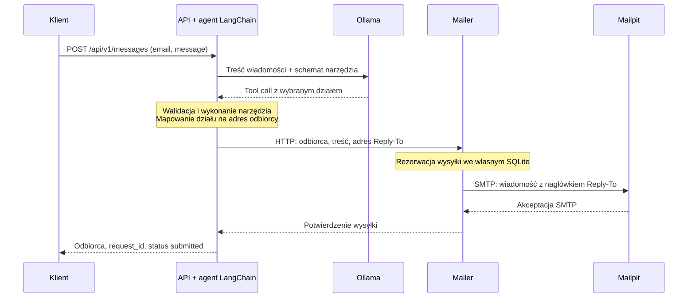

# Inteligentny router wiadomości

PoC mikroserwisów: Python, FastAPI, LangChain, lokalna Ollama i Mailpit.
Agent analizuje wiadomość i wykonuje narzędzie wysyłkowe przez native function
calling. Osobny serwis pocztowy przekazuje oryginalną treść przez SMTP do Mailpit,
ustawiając `Reply-To` na adres z requestu.

## Uruchomienie

Wymagania: Docker Engine / Docker Desktop z Compose **2.24 lub nowszym**, internet
przy pierwszym pobraniu obrazów i wag, wolne porty 8000 i 8025. Przeznacz na początek
8 GB RAM dla Dockera i zapas miejsca na obrazy oraz modele; jest to zalecenie
startowe, nie zmierzony minimalny próg. Domyślna konfiguracja używa CPU, także
w Docker Desktop na Apple Silicon. Nie wymaga Pythona ani klucza API na hoście.

Z głównego katalogu tego projektu:

```sh
docker compose up -d
```

Nie trzeba tworzyć `.env`. Compose buduje obrazy, uruchamia Ollamę i Mailpit,
pobiera `qwen3:1.7b`, rozgrzewa model i sprawdza rzeczywiste tool calling bez
wysyłki maila. Ollama jest przypięta do `0.13.5`, wersji sprzed regresji
serializacji narzędzi Qwen (#14601). Nie modyfikujemy szablonu ani wag modelu.
API startuje po pomyślnej inicjalizacji i gotowości mailera. Pierwszy start
może potrwać kilka minut lub dłużej, zależnie od internetu i CPU. Kolejne starty
wykorzystują zachowane wagi. Błąd inicjalizacji blokuje start API.

**Laya jest opcjonalna i domyślnie wyłączona.** Bez aktywnego profilu `laya`
Compose nie buduje ani nie uruchamia `laya-runtime` i `laya-adapter`, ani nie
pobiera wag Laya. Do podstawowego wariantu nie trzeba edytować Compose.

- Swagger: <http://localhost:8000/api/v1/docs>
- OpenAPI: <http://localhost:8000/api/v1/openapi.json>
- Mailpit: <http://localhost:8025>
- Gotowość: <http://localhost:8000/health/ready>

```sh
curl --fail-with-body http://localhost:8000/api/v1/messages \
  -H 'Content-Type: application/json' \
  -d '{"email":"jan.nowak@example.com","message":"Chciałbym zgłosić urlop na jutro"}'
```

Przykładowy kształt odpowiedzi (identyfikatory są generowane dla requestu):

```json
{
  "request_id": "e19f7b8a-1d0b-4a54-9f7c-cb0674fa5950",
  "recipient": "kadry@example.com",
  "status": "submitted",
  "message_id": "<e19f7b8a-1d0b-4a54-9f7c-cb0674fa5950@message-router.local>"
}
```

`submitted` oznacza akceptację SMTP, nie przeczytanie wiadomości przez człowieka.
W domyślnym środowisku odbiorcą SMTP jest Mailpit. Nie ma połączenia z produkcyjną
skrzynką ani dostarczania maili na zewnętrzne adresy.

## Architektura i Service Layer Pattern

**Przebieg jednego zgłoszenia** po uruchomieniu środowiska. Agent działa wewnątrz
API: model wybiera dział przez tool calling, a agent wykonuje narzędzie wysyłki.
Każdy serwis na diagramie to osobny kontener; klient jest poza aplikacją.



Wiadomość pozostaje w Mailpit i jest widoczna w jego panelu. SQLite jest prywatnym
magazynem mailera, bez osobnego kontenera. `model-init` przygotowuje model przed
startem API i nie uczestniczy w obsłudze zgłoszeń.

**Wybór modelu jest alternatywą, nie kolejnym etapem przepływu.** Powyżej pokazano
domyślną Ollamę. API korzysta z jednego endpointu wskazanego przez `OPENAI_BASE_URL`:

| Wariant            | Z czym komunikuje się agent w API                      | Sposób wyboru działu                                    |
| ------------------ | ------------------------------------------------------ | ------------------------------------------------------- |
| Ollama (domyślnie) | Kontener `ollama`                                      | Natywny tool call lokalnego LLM                         |
| OpenRouter         | Zewnętrzne API OpenRouter                              | Natywny tool call wybranego modelu                      |
| Laya (opcjonalnie) | Kontener `laya-adapter`, który odpytuje `laya-runtime` | Klasyfikator wybiera dział, adapter tworzy `tool_calls` |

Mailer i Mailpit obsługują każdy wariant tak samo. Kontenery Laya uruchamiają się
tylko po włączeniu profilu `laya`. Ollama pozostaje w Compose także przy innym
dostawcy, ale API wtedy jej nie odpytuje. [Konfiguracja wariantów](#dostawcy-przez-env).

| Kontener       | Odpowiedzialność                                                    |
| -------------- | ------------------------------------------------------------------- |
| `api`          | Publiczny endpoint, agent LangChain, wybór działu i wywołanie toola |
| `mailer`       | Niezależne API wysyłki, MIME, SMTP, własny trwały rejestr zleceń    |
| `mailpit`      | Przechwytywanie wiadomości oraz panel i API do ich kontroli         |
| `ollama`       | Lokalny model przez protokół OpenAI Chat Completions                |
| `model-init`   | Jednorazowe pobranie, rozgrzanie i kontrola dostępności modelu      |
| `laya-adapter` | Opcjonalna translacja typowanej decyzji na `tool_calls`             |
| `laya-runtime` | Opcjonalny silnik Laya, bez zależności od routingu i poczty         |

Router, mailer i adapter mają osobne obrazy, zależności, konfigurację i kontrakty
HTTP. Nie importują kodu sąsiada i nie współdzielą bazy. Mailer nie zna modelu,
a router nie zna SMTP ani bazy mailera. Sieć `smtp` jest wewnętrzna i niedostępna
routerowi; porty SMTP, mailera i modeli nie są publikowane na hoście. Połączenie
z dostawcą modelu jest jedyną zależnością routera wymagającą wyjścia do internetu.
Mailpit ma dodatkową sieć `mailpit-ui`, dzięki której Docker publikuje panel na
`127.0.0.1:8025`. Sama sieć `internal` nie zapewnia publikacji portu na hoście.
Port SMTP pozostaje niepublikowany, a mailer korzysta z wewnętrznej sieci `smtp`.

W każdej aplikacji biznesowej:

1. **Kontroler HTTP** waliduje DTO, wywołuje usługę i mapuje odpowiedź/błąd.
2. **Service layer** realizuje przypadek użycia przez porty (`Protocol`).
3. **Domena** zawiera wartości i błędy, bez FastAPI, LangChain czy SMTP.
4. **Adaptery** implementują komunikację z modelem, HTTP mailera, SMTP i SQLite.
5. **Composition root** (`main.py`) tworzy zależności w lifecycle aplikacji.

Agent jest celowo ograniczony do jednej decyzji i jednej czynności końcowej.
`create_agent(model=ChatOpenAI(...), tools=[...])` zarządza powiązaniem modelu
z narzędziem i jego wykonaniem. Jeden middleware sprawdza poprawność wywołania
przed wysyłką. `return_direct=True` kończy agenta po wykonaniu narzędzia.
Nie ma własnej pętli agenta, korekcyjnych ponowień ani heurystyk konkretnego
modelu. Schemat narzędzia używa standardowych enum, anyOf i description; każdy
dostawca dostaje te same opisy działów. Adapter Laya tłumaczy ten schemat na
swój format typed choice.

## Zasady routingu

Zadanie nie precyzuje granicy między HR i kadrami ani help deskiem i IT. Dlatego
przyjęto następujący jawny podział, zapisany w polityce routera:

Użytkownik podaje swój adres kontaktowy i treść. Model otrzymuje treść oraz
znaczenie działów i sam wybiera `department`. Adresy odbiorców znajdują się
wyłącznie w mapowaniu aplikacji i konfiguracji mailera. Model nie otrzymuje
gotowego odbiorcy ani nie musi wnioskować o znaczeniu działu z adresu e-mail.

| Dział                         | Typ sprawy                                                             |
| ----------------------------- | ---------------------------------------------------------------------- |
| `human-resources@example.com` | Rekrutacja, szkolenia, rozwój, relacje pracownicze                     |
| `kadry@example.com`           | Urlopy, płace, czas pracy, dokumenty zatrudnienia                      |
| `help-desk@example.com`       | Pomoc pojedynczemu użytkownikowi: komputer, drukarka, hasło            |
| `it@example.com`              | Infrastruktura, serwery, awarie sieci/systemów, cyberbezpieczeństwo    |
| `other@example.com`           | Nierozpoznany temat, treść niezwiązana z działami lub niewystarczająca |

Fallback jest decyzją semantyczną. Awaria modelu nie jest zamieniana na wysyłkę do
`other`. Dla kilku tematów agent ma wybrać główną prośbę. Nie deklarujemy idealnej
trafności małego modelu: mierzy ją zestaw akceptacyjny w `verification/cases.json`.

## Dostawcy przez env

Klient routera pozostaje ten sam. Zmieniają się `OPENAI_BASE_URL`, `OPENAI_API_KEY`,
`OPENAI_MODEL` oraz sposób inicjalizacji i profil potrzebnych kontenerów.
Obsługiwany jest tekstowy Chat Completions z function calling. Nie każdy model
oferowany przez dostawcę obsługuje tools. Rozszerzenia Responses API, multimodalność
i specyficzne parametry reasoning nie są częścią wspólnego kontraktu.

Przykłady nie zawierają sekretów:

| Wariant                          | Aktywny profil | Kontenery Laya    |
| -------------------------------- | -------------- | ----------------- |
| Domyślny / `.env.ollama-example` | brak           | Wyłączone         |
| `.env.openrouter-example`        | brak           | Wyłączone         |
| `.env.laya-example`              | `laya`         | Runtime i adapter |

`COMPOSE_PROFILES=laya` w przykładzie Laya włącza oba kontenery. Ten sam plik
ustawia `OPENAI_BASE_URL` na adapter. Samo `--profile laya` nie przełącza klienta
modelu. Profile można ustawić również w `.env` lub powłoce; usuń takie ustawienie,
jeśli ma obowiązywać wariant domyślny.

```sh
# Ollama; równoważne domyślnemu uruchomieniu.
docker compose --env-file .env.ollama-example up -d

# Laya: uruchamia dodatkowo silnik i adapter, bez pobierania wag Ollamy.
docker compose --env-file .env.laya-example up -d
```

Dla OpenRouter skopiuj `.env.openrouter-example` do ignorowanego `.env`, wpisz
własny klucz i wybierz dostępny model obsługujący tools, następnie:

```sh
docker compose up -d
```

Ollama pozostaje uruchomiona także przy dostawcy zewnętrznym, ale bez pobierania
niepotrzebnych wag. Przy przełączaniu wariantu zachowaj ten sam plik env we
wszystkich komendach. Aby zatrzymać poprzedni wariant przed zmianą, użyj
`docker compose --env-file <poprzedni-plik> down` bez `--volumes`; dane pozostaną.
Po zmianie kodu użyj `up -d --build`. `.env.example` opisuje pełną konfigurację.

Jeśli Laya była wcześniej uruchomiona, samo wyłączenie profilu nie zatrzyma jej
kontenerów. Powrót do Ollamy z zachowaniem danych i pobranych wag:

```sh
docker compose --env-file .env.laya-example stop laya-adapter laya-runtime
docker compose --env-file .env.ollama-example up -d
```

Mechanizm profili opisuje [dokumentacja Docker Compose](https://docs.docker.com/compose/how-tos/profiles/).

### Różnica wariantu Laya

Laya jest rzeczywistym modelem typowanych decyzji, nie modelem generującym natywne
wywołania funkcji. Adapter przyjmuje dokładnie jedno narzędzie z jednym argumentem
`string enum`, przekazuje opcje, osobne opisy działów i krótkie pytanie przez HTTP do Laya, a odpowiedź
`choice` opakowuje w `tool_calls`. Sam nie zna adresów działów i nie klasyfikuje
słowami kluczowymi. Nie ma dostępu do mailera.

Silnik używa `laya==0.3.20` i ładuje checkpoint `multilingual` (mmBERT-base)
przed zgłoszeniem gotowości. W tej poprawce nie trenowano ani nie zmieniano wag. Cienki host
wykorzystuje publiczne `Router.predict(..., max_len=8192)` i format
`/v1/systemone`. Jawny limit chroni przed użyciem domyślnych 1024 tokenów serwera
upstream. Adapter przyjmuje do 7000 bajtów łącznej treści, instrukcji i opcji;
nadmiar jest odrzucany, a nie obcinany. To dodatkowy wariant porównawczy.
**Ścieżką spełniającą wymaganie lokalnego LLM z natywnym function calling jest Ollama.**

Przed poprawką Laya uzyskała **6/15**, po przekazaniu polskich opisów działów
uzyskała **13/15** na tych samych wiadomościach (25.09.2026). Pozostały błędy
klasyfikacji niedziałającego komputera i pytania o historię Rzymu jako IT.
Laya nadal nie spełnia pełnego kryterium trafności. Ollama po zmianie schematu
narzędzia ponownie zaliczyła **15/15**. Wyniki i granice dowodów:
[raport weryfikacji](docs/VERIFICATION.md).
Podczas testów wystąpiły też okresowe błędy sondy tool calling w inicjalizatorze
Ollamy, blokujące start API. Ich przyczyna pozostaje nieustalona; udany przebieg
E2E nie stanowi potwierdzenia niezawodności każdego startu.

## Błędy, potwierdzenia i dane

- HTTP 422: niepoprawny e-mail, pusta wiadomość, ponad 4000 znaków lub nadmiarowe pola.
- HTTP 502 z `code` i `request_id`: awaria modelu, błędne tool calling lub niepotwierdzona wysyłka.
- Model wybiera wyłącznie dział z enum; aplikacja ustala jego adres. Reply-To i treść pochodzą z requestu,
  From z konfiguracji mailera. Dodatkowe argumenty narzędzia są odrzucane.
- Mailer sprawdza swoją listę dopuszczonych odbiorców i token połączenia usługowego.
  Domyślny token jest publiczną wartością PoC, a port mailera pozostaje wewnętrzny.
- Każdy request ma UUID, przekazywany do mailera jako klucz zlecenia i nagłówek
  `X-Request-ID`. Mailer zapisuje rezerwację przed SMTP. Ten sam UUID i payload
  zwracają wcześniejsze potwierdzenie, inny payload daje konflikt.
- `failed` oznacza znane odrzucenie, `unknown` brak pewnego potwierdzenia.
  Po restarcie niedokończone `sending` przechodzi w `unknown`. Nie ma automatycznego
  ponawiania niepewnych operacji. Mailer pracuje jako **jedna instancja na wolumen**.
- Awaria zapisu rezerwacji daje `mailer_unavailable` przed jakąkolwiek próbą SMTP.
  Awaria utrwalenia wyniku po wywołaniu transportu daje `delivery_unknown`.
- Ponowne wysłanie publicznego POST tworzy nowe zgłoszenie. Nie jest deduplikowane
  między requestami. Nie ponawiaj go bez sprawdzenia Mailpit po błędzie niepewnej wysyłki.
- Status zlecenia jest dostępny przez chronione, wewnętrzne
  `GET /internal/v1/deliveries/{request_id}`. Treść i adres nadawcy nie trafiają do
  logów aplikacji. Rejestr mailera przechowuje hash payloadu i potwierdzenia,
  a pełne wiadomości przechowuje Mailpit.

To PoC, bez publicznego uwierzytelniania, limitów ruchu, HA ani produkcyjnego MTA.
Lokalne porty są ograniczone do loopback. Unified Mail Core nie jest wymagany ani
dołączony: ewentualny adapter z jego outboxem może zastąpić mailer za tym samym
kontraktem, ale status `queued` nie może udawać `submitted`.

## Parametry modelu i błędne wywołania

Wariant Ollama jawnie wyłącza thinking przez `MODEL_REASONING_EFFORT=none`,
ustawia `MODEL_TEMPERATURE=0.7` i `MODEL_TOP_P=0.8`. Puste wartości pomijają te
opcje, czego wymagają niektórzy dostawcy oraz adapter Laya. Szablony env zawierają
odpowiednie ustawienia. `MODEL_TOKEN_LIMIT_FIELD=max_tokens` zachowuje pole
obsługiwane przez przypiętą Ollamę; można wybrać `max_completion_tokens` dla
innego endpointu. Sam wspólny format OpenAI nie oznacza identycznych możliwości
wszystkich dostawców.

Agent wykonuje jedno wywołanie modelu z limitem `MODEL_TIMEOUT_SECONDS=180`.
Niepoprawny tool call kończy request błędem `invalid_tool_call`, bez wysyłki.
Agent sprawdza nazwę narzędzia, dokładnie jeden argument `department`, wartości
z enum i nieuciętą odpowiedź. Nie usuwa nadmiarowych argumentów ani nie zgaduje
wywołania z tekstu. Po wysyłce nie ma kolejnej próby modelu ani mailera.
Logi API rozróżniają brak wywołania, błędne argumenty, wiele wywołań, niewłaściwą
nazwę i jawne zakończenie `length`. Sam licznik tokenów nie oznacza błędu. Szczegóły naprawy i źródła:
[TOOL_WIRING.md](docs/TOOL_WIRING.md).

## Testy i diagnostyka

Obserwowane debugowanie: [OBSERVED_DEBUGGING.md](docs/OBSERVED_DEBUGGING.md).
`MODEL_TRACE=true` włącza w logach API surowe requesty i odpowiedzi modelu,
wynik parsowania, walidacji i wysyłki po wspólnym `request_id`. Wyłącznie dla
syntetycznych danych lokalnych; domyślnie wyłączone. Inference nadal korzysta
z ChatOpenAI i API OpenAI-compatible, bez klienta Ollamy. Przed kolejnym
przypadkiem odczytać trace; nie uruchamiać nieobserwowanych testów modelu.

Rozszerzony zbiór: [500 syntetycznych wiadomości po polsku](verification/benchmark/cases-500.json),
po 100 na każdy z pięciu działów. Zawiera 250 scenariuszy w dwóch wariantach:
bazowym oraz z zamkniętym wcześniejszym wątkiem. Obejmuje krótkie niepełne prośby,
zwykłe zgłoszenia i dłuższe wiadomości z konkretnymi szczegółami. Etykiety i ich
uzasadnienia powstały razem ze scenariuszami; nie pochodzą z przewidywań modeli.
To kontrolowany benchmark syntetyczny, nie próbka rzeczywistej skrzynki.

Dotychczasowy test 15 wiadomości pozostaje domyślny. Duży zbiór wybiera się jawnie:

```sh
docker compose --env-file .env.ollama-example --profile test run --build --rm e2e \
  python e2e.py --cases benchmark/cases-500.json
```

Dla Laya użyj `.env.laya-example`. Do API trafiają tylko adres nadawcy i treść;
odpowiedzi wzorcowe pozostają w teście. Wyniki zapisują identyfikatory przypadków,
rodzin i SHA-256 dokładnie użytego pliku, a przy błędzie HTTP także jego kod
oraz `request_id`. Aktualne wyniki: [VERIFICATION.md](docs/VERIFICATION.md).
Wykonanie wymaga działającego wariantu usług. `MAILPIT_MAX_MESSAGES` (domyślnie
10 000) musi pomieścić wcześniejszą pocztę i nowy przebieg bez automatycznego
usuwania najstarszych wiadomości.
Źródła, ograniczenia par scenariuszy, kontrole i wznowienie:
[BENCHMARK_APPROACH.md](docs/BENCHMARK_APPROACH.md).

```sh
# Konfiguracja nie wymaga działającego daemonu.
docker compose config --quiet

# Testy jednostkowe, kontraktowe i granic architektury, bez dostępu do sieci w runtime.
docker compose --profile test run --build --rm tests

# Prawdziwy model + HTTP + SMTP + Mailpit, 15 wiadomości po polsku.
docker compose --profile test run --build --rm e2e

# Ta sama weryfikacja dla Laya.
docker compose --env-file .env.laya-example --profile test run --build --rm e2e

docker compose ps -a
docker compose logs --tail 100 model-init api mailer
```

Test E2E kontroluje Swagger, adres docelowy, surowy MIME, Reply-To, Message-ID,
korelację i treść każdego maila. Kończy się błędem, jeśli którykolwiek przypadek
nie przejdzie. Nie kasuje istniejących wiadomości; każde uruchomienie dodaje nowy
zestaw syntetyczny. Wynik wypisuje jako JSONL, wraz z opóźnieniami.

Przy nieudanym pobraniu zachowaj wolumen i ponów `docker compose up -d model-init`.
Po naprawie inicjalizacji uruchom `docker compose up -d`. Błąd klucza, nieistniejący
model, brak native tool calling i timeout inicjalizacji mają pozostać widocznymi
błędami. Nie podmieniaj modelu na atrapę w celu uzyskania zielonego healthchecka.

Stan faktycznie wykonanych kontroli i ograniczenia: [VERIFICATION.md](docs/VERIFICATION.md).
Odtwarzalne podejście i wznowienie: [APPROACH.md](docs/APPROACH.md).
Kontrakty usług: [CONTRACTS.md](docs/CONTRACTS.md).

## Referencje

- [LangChain tools](https://docs.langchain.com/oss/python/langchain/tools)
- [ChatOpenAI i tool calling](https://docs.langchain.com/oss/python/integrations/chat/openai)
- [Ollama OpenAI compatibility](https://docs.ollama.com/api/openai-compatibility)
- [Gotowość zależności Compose](https://docs.docker.com/compose/how-tos/startup-order/)
- [Mailpit API](https://mailpit.axllent.org/docs/api-v1/)
- [Laya, SDK i granice modelu](https://github.com/NandhaKishorM/laya)

`MODEL_TOOL_CHOICE` steruje standardowym polem wyboru narzędzia: puste pomija
pole, `auto` zostawia wybór modelowi, `required` wymaga narzędzia, a `named`
wskazuje funkcję `send_department_email`. Wsparcie zależy od backendu: przykład
Ollamy pomija pole (ta wersja je ignoruje), Laya używa `required`, a OpenRouter
`named` i wymaga obsługi przez wybrany model/backend. Nie wykonujemy automatycznego
ponowienia z innymi ustawieniami. Polityka działów znajduje się w system prompt;
schemat zachowuje opisy kategorii potrzebne adapterowi Laya.

Ostatnia obserwowana próba po uproszczeniu opisu narzędzia i doprecyzowaniu polityki:
2 z 4 wybranych przypadków poprawne, 2 nadal bez wywołania narzędzia. To mała
próba diagnostyczna, nie pomiar skuteczności. Problem lokalnego modelu/backendu
pozostaje; [surowe dowody i wyniki](docs/evidence/2026-09-25/routing-policy/README.md).

Późniejsze porównanie z `qwen3:4b-instruct-2507-q4_K_M`, bez zmian kodu,
zaliczyło te same **4/4 przypadki**, w tym oba wcześniejsze błędy. To nadal
wybrana próba HR/kadry, nie ogólna skuteczność. Kandydat pozostaje aktywny
lokalnie; domyślny model repozytorium nie został zmieniony.
[Konfiguracja eksperymentu, surowe logi i przechwycone maile](docs/evidence/2026-09-25/qwen4b-instruct/README.md).

Pełny przebieg został następnie zatrzymany przez użytkownika na **190/500**.
Audyt surowych odpowiedzi i wszystkich 190 przechwyconych maili potwierdził
100 poprawnych HR i 90 kadry, bez błędów protokołu ani duplikatów. To 95 par
scenariuszy i tylko dwa działy; korpus był już używany podczas debugowania.
Nie potwierdza to ogólnej skuteczności ani powtarzalności.
[Audyt dowodów i ograniczenia](docs/evidence/2026-09-25/qwen4b-500/FORENSIC_REVIEW.md).
